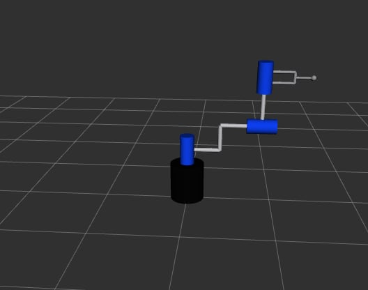
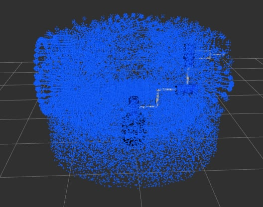

# ProjektROS2

Model robota RRR w ROS2 dla konfiguracji osi:

```text
|-|
```

Repozytorium zawiera pakiet `projektDM` z modelem URDF, plikiem launch oraz skryptami do sterowania przegubami i wizualizacji workspace.

## Autorzy projektu

Projekt wykonali:

- Dominik Stawarczyk
- Maciej Sowa

## Wymiary modelu

Podstawowe wymiary przyjęte w modelu:

```text
BASE_HEIGHT  = 0.45 m
BASE_RADIUS  = 0.20 m

JOINT_LENGTH = 0.34 m
JOINT_RADIUS = 0.085 m

ROD_LENGTH   = 0.30 m
ROD_RADIUS   = 0.025 m
```

Elementy modelu:

- podstawa: czarny cylinder,
- przeguby: trzy jednakowe niebieskie walce,
- pręty konstrukcyjne: cztery jednakowe srebrne walce,
- efektor końcowy: osobna srebrna konstrukcja.

Cztery główne pręty konstrukcyjne mają identyczne wymiary:

```text
długość = 0.30 m
promień = 0.025 m
średnica = 0.05 m
```

Przeguby mają identyczne wymiary:

```text
długość = 0.34 m
promień = 0.085 m
średnica = 0.17 m
```

## Obliczenia

Wszystkie obliczenia wykorzystane w projekcie zostały umieszczone w osobnym pliku PDF znajdującym się w folderze `pdf/`.

Plik z obliczeniami:

[Obliczenia.pdf](pdf/Obliczenia.pdf)

## Podgląd modelu

Widok modelu robota w RViz:



Widok wygenerowanego workspace:



## Najważniejsze pliki

```text
launch/robotDM.launch.py
projektDM/simulate_joints.py
projektDM/workspace.py
robotModel/
pdf/Obliczenia.pdf
```

### `robotDM.launch.py`

Plik launch uruchamia model robota w ROS2/RViz.

```bash
ros2 launch projektDM robotDM.launch.py
```

### `simulate_joints.py`

Skrypt publikuje wiadomości `JointState` na temat:

```text
/joint_states
```

Służy do ręcznego zadawania kątów trzech przegubów:

```text
arm_1_joint
arm_2_joint
arm_3_joint
```

Kąty są wpisywane w stopniach i konwertowane na radiany.

Każda zadana konfiguracja jest ustawiana względem konfiguracji bazowej:

```text
0 0 0
```

```bash
ros2 run projektDM simulate_joints
```

### `workspace.py`

Skrypt generuje i publikuje marker workspace robota.

Workspace uwzględnia:

- zakresy ruchu przegubów,
- efektor końcowy,
- dolny obszar pracy.

Marker publikowany jest na temat:

```text
/workspace_marker
```

```bash
ros2 run projektDM workspace
```

## Wizualizacja

Model, sterowanie przegubami oraz workspace są przygotowane pod wizualizację w RViz.

W RViz jako `Fixed Frame` należy ustawić:

```text
world
```

## Budowanie

Z poziomu workspace ROS2:

```bash
colcon build
source install/setup.bash
```

Po przebudowaniu pakietu:

```bash
ros2 launch projektDM robotDM.launch.py
ros2 run projektDM simulate_joints
ros2 run projektDM workspace
```
